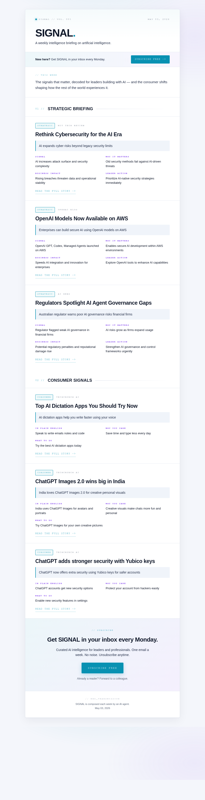

# SIGNAL — Weekly AI Intelligence Briefing

An autonomous agent that fetches the week's AI news from trusted sources, picks the most important stories for two audiences (business leaders and everyday users), and publishes a polished HTML newsletter every Monday.

Built as a learning project for the **MIT Applied Agentic** course.



## What it does

The agent is a four-step pipeline:

1. **Fetcher** — Pulls RSS feeds from MIT Tech Review, OpenAI, AI News, VentureBeat, TechCrunch, The Verge, and Wired.
2. **Editor** — Asks the LLM to pick 3 stories for business leaders and 3 stories for everyday users from the past 7 days.
3. **Writer** — Asks the LLM for a structured JSON summary of each story (headline, TL;DR, four labeled points).
4. **Publisher** — Renders the JSON into a clean HTML newsletter using a fixed design template.

The thinking happens in the LLM. The presentation happens in deterministic Python. That separation is the heart of agentic design: keep the creative parts creative and the predictable parts predictable.

## Quickstart

See [`BUILD_GUIDE.md`](BUILD_GUIDE.md) for the full step-by-step walkthrough — local run, GitHub setup, weekly automation.

```bash
pip3 install -r requirements.txt
export OPENAI_API_KEY="sk-..."
python3 agent.py
```

## Autonomous mode

A GitHub Action (`.github/workflows/weekly-newsletter.yml`) runs the agent every Monday at 08:00 UTC and commits the new HTML into `newsletters/` in this repo.

## Configuration

All knobs at the top of `agent.py`:

| Setting | Default | Purpose |
|---|---|---|
| `MODEL` | `gpt-4o-mini` | OpenAI model |
| `TEMPERATURE` | `0.3` | Predictability vs. creativity |
| `TOP_BUSINESS` | `3` | Business stories per issue |
| `TOP_EVERYDAY` | `3` | Consumer stories per issue |
| `LOOKBACK_DAYS` | `7` | News window |
| `SIGNUP_URL` | `"#"` | Subscribe-button destination |
| `SOURCES` | dict | RSS feeds |

## Cost

About $0.01 per weekly run with `gpt-4o-mini`.

## License

MIT.
